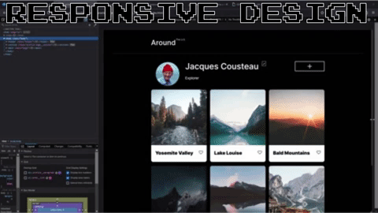

#  Project 3: Around The U.S.

## Overview  

A gallery of various landmarks throughout the United States. A base build using HTML and CSS to create the gallery, and specifically utilizing grid styles and relative dimensions in order to create a responsive design.  
  
### Features

Responsive Design: The web page reacts to different resolutions by collapsing or adjusting sizes 
